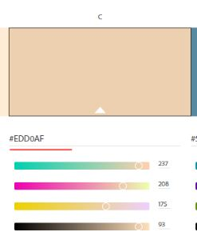
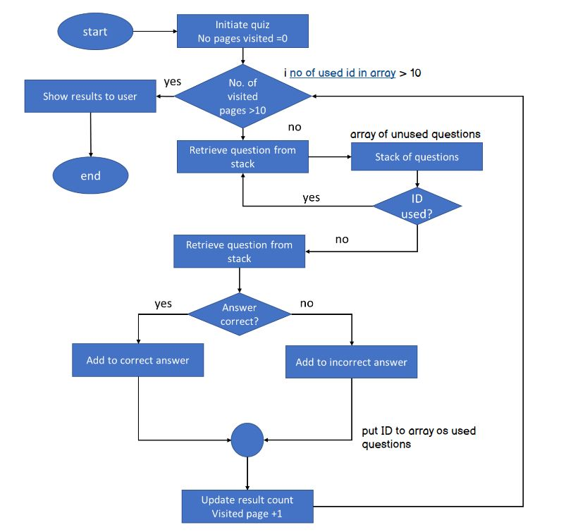

# History fun fact quiz

History fun fact quiz is a site that provides a short and fun quiz for anyone who likes quizes and historical topics with fun facts. 

## Features

### Color scheme
Background color Peach ( #EDD1B0) has been chosen based on study: "Good Background Colors for Readers:A Study of People with and without Dyslexia". THis bacground colour is show to have one of the lowest reading time with   oneof the lowest data spread between both the Dyslexia Group and Control Group. 

### Font selection
Roboto Medium font has been chosen for headers with recommended Lato Regular for easier reading. 

### Quiz flow 
The site consists of an intro greeting and an initiate quiz button. Once the quiz is initiated, the stack of questions is drawn from an array of unused questions. Each question offers 4 answers to choose from as well as an image related to the topic. Questions are inspected if they have already been provided to the user. If the question has already been previously read by the user during the ongoing quiz sessions, it is replaced with the unread question.  

Once the user answers and submits the question, the javascript identifies if the answer is correct or wrong and adds the number to the count to either to wrong or correct answer. The process continues till the user uses answers ten questions. In the end, the user is congratulated on participation with the image of Napoleon and displayed score. 

## Testing

## Deployment

## Cedits

### Images

Most of the images have been aqured from [Pixabay](https://pixabay.com/). 
Big shout out to:
* [Scarlet_Letter](https://pixabay.com/users/scarlet_letter-1644696/) for image of the [printing press](https://pixabay.com/illustrations/printing-press-printing-press-paper-1093509/).
* [ArtTower](https://pixabay.com/users/arttower-5337/) for images of [Venice](https://pixabay.com/illustrations/venice-italy-6683160/) and [barrels](https://pixabay.com/photos/barrels-kegs-casks-wine-containers-52934/) 
* [GDJ](https://pixabay.com/users/gdj-1086657/) for images of [trade caravan](https://pixabay.com/vectors/beach-camels-caravan-people-5437910/) and [Columbus](https://pixabay.com/vectors/christopher-columbus-portrait-6471762/)
* [ArtsyBee](https://pixabay.com/users/artsybee-462611/) for [Egyptian themed](https://pixabay.com/illustrations/egyptian-design-man-woman-priest-1822015/) image
* [jon57](https://pixabay.com/users/jon57-1587760/) for image of [fort cannon](https://pixabay.com/photos/cannon-gun-rampart-battlement-2034724/)
* [Ri_Ya](https://pixabay.com/users/ri_ya-12911237/) for nice image of [coffee beans](https://pixabay.com/photos/coffee-beans-seed-caffeine-cafe-6632524/)
* [WikiImages](https://pixabay.com/users/wikiimages-1897/) for an image of [Napoleon](https://pixabay.com/photos/napoleon-bonaparte-emperor-france-67784/) and [French Revolution](https://pixabay.com/users/wikiimages-1897/)