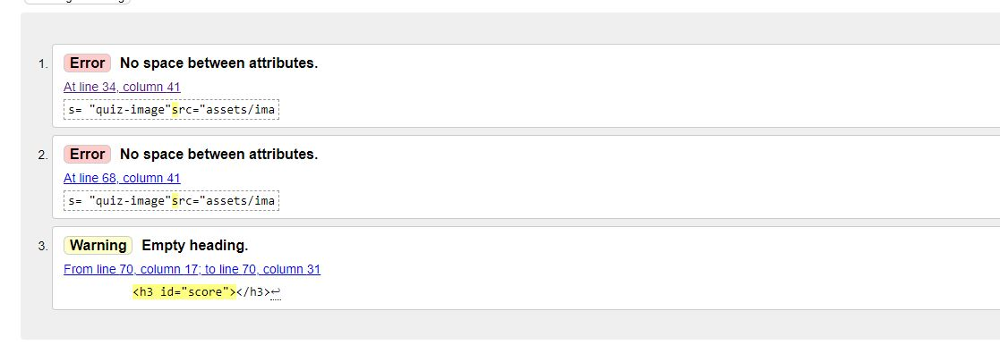

# History fun fact quiz

History fun fact quiz is a site that provides a short and fun quiz for anyone who likes quizzes and historical topics with fun facts. Images presented in the quiz help you to get into the theme of the question. Have fun! 

## Features

### Color scheme
Background color Peach ( #EDD1B0) has been chosen based on study: ["Good Background Colors for Readers:A Study of People with and without Dyslexia"](https://www.researchgate.net/publication/320541475_Good_Background_Colors_for_Readers_A_Study_of_People_with_and_without_Dyslexia). THis bacground colour is show to have one of the lowest reading time with   oneof the lowest data spread between both the Dyslexia Group and Control Group. #BAA48A has been chosen for button colors. It fits nice with the background color and makes the text readable. 

### Font selection
Roboto Medium font has been chosen for headers with recommended Lato Regular for easier reading. 

### Quiz flow 
The site consists of an intro greeting and an initiate quiz button. Once the quiz is initiated, the stack of questions is drawn from an array of unused questions. Each question offers four answers to choose from as well as an image related to the topic. Questions are inspected if they have already been provided to the user. If the question has already been previously read by the user during the ongoing quiz sessions, it is replaced with the unread question.  

Once the user answers and submits the question, the javascript identifies if the answer is correct or wrong and adds the number to the count to either to wrong or correct answer. The process continues till the user uses answers ten questions. In the end, the user is congratulated on participation with the image of Napoleon and displayed score. 

#### Wireframes
[Wireframes](docs/wireframes/PP2-History_Fun_Facts-wireframes.pdf) have been used as guidelines to build the quiz page. The quiz page consist of three main areas.

The first area is the intro page. This area contains the welcoming text with instructions and the start quiz button.  This area reveals the quiz area while being hidden by clicking the "Start Quiz" button..

The quiz area provides the user with the questions and four possible answers, and a quiz image that fits the topic of the given question. By clicking on the answer, the user is informed if the question was correct or false. JavaSript is calculating score in the background. After the user clicks ok on the alert message, the quiz area removes the answered question and moves on to the new question. When then questions have been answered, the quiz area becomes hidden, and quiz end area is revealed to the user. 

Quiz end area thanks the user for participating and displays the total score to the user. Napoleon's picture is displayed to keep with the historical theme. By clicking the "Back to home" button, the page reloads, and the user is shown the intro page area. From this point, the user can retry the quiz.

### Questions

Content has been chosen based on the reads of the pages credited in the code in the js. The idea was to present fun facts that are not too common but also not too specific to make it fun for the wider audience and encourage curiosity for topics related to history.  

### Features to implement

For future development, the following items are taken into consideration:
* creation of json file that contains 30+ questions
* adding code to shuffle questions to increase the repeatability of the quiz
* adding code to shuffle the order of the offered answers 
* introducing a fun fact text related to the question to make the quiz more rewarding
* improving Accessibility.

## Testing

Testing has been performed before and after site deployment.

### Testing JavaScript code

Testing of JavaScript code has been performed using browser view created in Gitpod and console.logs. With this approach, I was able to see if the code worked as intended and root cause the error if not. Bes example of this approach was comparing the selected question from the HTML button element to the correct awnser in the js object. Through the console.log I realized that the value I chose was not appropreate, and I had to target if e.srcElement.innerText and compare it to the correct question. 

### CSS code validation

CSS code has been validated using Jigsaw W3C. Errors encountered were related to margin definition. 

Margins have been redefined and the code reevaluated. And the code validation has passed.

### HTML code validation

HTML code has been validated using W3C validator. Initial validation showed two errors due to no spacing between attributes in the HTML elements and an empty heading.

After the error is corrected, the code has been re-evaluated, and validation has passed.

### JavaSrcipt code validation

JavaScript code has been validated in jshint. Most of the errors were related to missing semicoms, with a couple of errors being related to unused variables. The unused variables were a result of previous use of the code that was planned to be implemented or rendered obsolete as the code evolved.

After the code has been cleaned, hidenIntro is registered as an unused variable. This function has been in onclick attribute in HTML button element to initiate the quiz. Without this creature, the quiz would not be initiated. For that reason, this message has been ignored.

### Lighthouse test

A Lighthouse test has been performed to inspect the page. From the test report, it can be seen that the Accessibility was 89% and in the orange area. 

After some research and reading the report, the HTML code has been updated to improve Accessibility. The second lighthouse test shows the Accessibility has been increased to 91%.

Due to the time constraints, no further work was performed to increase the Accessibility. Future development of this code will be focused on improving the Accessibility.

### Overflow

Unicorn revealer add-on was used to inspect the web page overflow – This tool proved useful during the pre-deployment phase. There were minor overflow issues that needed to be fixed. Overflow between the image in the intro area and paragraph were interfering. After the implementation of Unicor revealer and use of dev tool the issue has been fixed.

## Deployment

Deployment has been performe in the following steps:

* Public repository Project 2 has been selected: https://voidwulf.github.io/Quiz_project/
* GitHup Pages has been used for deployment
* Main branch has been chosen as a source

* Deploy link has been generated for use
* Site has been deployed using Git Pages. After the link has been generated, the site has been tested on desktop web browser, ASUS tablet and Samsung M30 smart phone
* Link has been sent to friends to receive feedback on how the code works on other devices
* Most feedback has been related to typos that been fixed thanks to [Grammarly](https://www.grammarly.com/)
* [Am I Responsive](http://ami.responsivedesign.is/) has been used to check how the display works across platforms. There were corrections required in CSS to accommodate laptops and tablets. Small adjustments have been made for mobile.
* Dev tools have been used for debugging and testing website during after deployment

## Cedits

### Images

Most of the images have been aqured from [Pixabay](https://pixabay.com/). 
Big shout out to:
* [Scarlet_Letter](https://pixabay.com/users/scarlet_letter-1644696/) for image of the [printing press](https://pixabay.com/illustrations/printing-press-printing-press-paper-1093509/).
* [ArtTower](https://pixabay.com/users/arttower-5337/) for images of [Venice](https://pixabay.com/illustrations/venice-italy-6683160/) and [barrels](https://pixabay.com/photos/barrels-kegs-casks-wine-containers-52934/) 
* [GDJ](https://pixabay.com/users/gdj-1086657/) for images of [trade caravan](https://pixabay.com/vectors/beach-camels-caravan-people-5437910/) and [Columbus](https://pixabay.com/vectors/christopher-columbus-portrait-6471762/)
* [ArtsyBee](https://pixabay.com/users/artsybee-462611/) for [Egyptian themed](https://pixabay.com/illustrations/egyptian-design-man-woman-priest-1822015/) image
* [jon57](https://pixabay.com/users/jon57-1587760/) for image of [fort cannon](https://pixabay.com/photos/cannon-gun-rampart-battlement-2034724/)
* [Ri_Ya](https://pixabay.com/users/ri_ya-12911237/) for nice image of [coffee beans](https://pixabay.com/photos/coffee-beans-seed-caffeine-cafe-6632524/)
* [WikiImages](https://pixabay.com/users/wikiimages-1897/) for an image of [Napoleon](https://pixabay.com/photos/napoleon-bonaparte-emperor-france-67784/) and [French Revolution](https://pixabay.com/users/wikiimages-1897/)